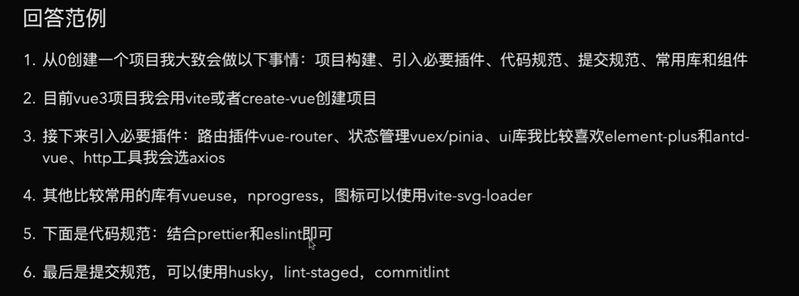

# NextTick的理解

- 官方的定义：在下一次DOM更新循环结束后执行延迟回调，在修改数据之后立即使用这个方法，获取更新后的DOM

什么意思呢？
    我们可以理解成，vue更新DOM时是异步执行的。当数据发生变化，vue将开启一个异步更新队列，视图需要等队列中所有数据变化完成之后，再统一进行更新

由于vue采用的是“异步更新策略”，数据变化了之后不会立即去更新DOM结构，而是去开启一个任务队列，去缓存在同一个事件循环中发生的所有的数据变更，好处就是将多次数据更新合并成一次，减少操作DOM的次数

如果不采用这种方法，数据变更一百次就会去更新一百次DOM，非常消耗性能。

使用场景：想要操作基于最新数据生成的DOM

它的实现原理：将传入的回调函数包装成异步任务，为了尽快执行，它选择的是微任务

nexttick源码里它提供了四种异步的方法，promise.then
MutationObserver、setImmediate、setTimeout(fn,0)

我比较熟悉的就是MutationObserver，这个api的作用就是在可以创建一个实例对象，去调用其身上的observe方法，就可以监听dom更新后去执行相应的回调，比如把传进来的fn参数调用掉fn（）

# watch和computed的区别

- 功能方面： computed是计算属性，watch是用来监听数据的变化，然后去执行对应的回调函数的

    computed ： 具有响应式的返回值
    watch： 侦测变化，执行回调

- 计算属性computed常用于简化模板中的复杂的表达式

- 缓存方面。computed中的函数所依赖的数据没有发生变化的话，使用computed计算出来的数据会从缓存中获取，而watch在每次监听的值发生变化的时候都会去执行回调

- 监听：computed默认第一次加载就开始监听，而watch需要设置immediate：true才能在第一次加载时就监听

- 使用场景： computed：一个数据受多个数据所影响，例如购物车结算。watch：当一条数据影响多条数据，用watch，例如搜索框

- 异步操作：watch更适用于数据变化时的异步操作

# 虚拟DOM

- 用js操作真实DOM是有代价的：用原生js操作DOM，浏览器会从构建DOM树开始，到页面渲染，包括重排重绘重新执行一遍，再一次操作中，假设要更新10个DOM节点，浏览器会执行十次DOM的更新，例如，第一次更新了DOM，后面又执行了这个DOM的更新，节点的坐标值又改变了，前一次计算就是在做无用功，所以原生js去操作DOM的性能开销是很大的

- 概念：是js按照DOM的结构来创建的虚拟树型结构对象，是对DOM的抽象，比DOM更加轻量

- 虚拟DOM的好处： 如果一次操作中有10次更新DOM的操作，虚拟DOM不会立即执行操作DOM，而是将10次更新的diff内容保存到一个本地的js对象中，最终再将其一次性变成真正的DOM结构，可以避免大量的没有用的计算量。所以虚拟DOM可以将页面的更新先全部反映在JS对象（虚拟DOM）上，操作内存中的js对象的速度显然会更快，等待更新完成后，再将最终的JS对象变成真实的DOM，交给浏览器去绘制

# diff算法

- 定义：用于快速的比对新旧虚拟DOM树，减小更新性能消耗

- 它首先会对新树和旧树进行根节点的对比

    如果两个虚拟节点的标签类型，key值都相同

    - 如果两个根节点不同：直接根据新的虚拟DOM去创建真实DOM，旧树对应的真实DOM不要了

    - 如果两个根节点相同: 旧树对应的真实DOM需要重复使用，进入更新的流程
        
        - 根节点的对比
    - 会将新树的那个虚拟节点的element指向旧树虚拟节点所对应的真实DOM

    - 然后对比新节点和旧节点的属性，有变化的就更新到真实DOM里面去

        - 对比子节点
            1. 老的有子节点，新的没有子节点，直接移除掉真实DOM里老的的子节点

            2. 新的节点有儿子，老的节点没有儿子，加上

            3. 是文本的情况，直接创建文本

            4. 都有子节点的话，利用双指针：头头，尾尾，头尾，尾头 -> 对比查找之后移动他们的位置进行复用

        
    - 采用的是深度优先递归+双端交叉指针 头头，尾尾，头尾，尾头
    vue3 则用的是最长递增子序列 只对比队头和队头，队尾和队尾，一旦没有匹配上就进行最长递增子序列算法

# vue生命周期

- 是什么：生命周期就是用来描述一个组件从引入到退出的全过程。一个组件从创建->数据初始化->挂载->更新->销毁
在这个过程中会运行生命周期的勾子函数，以便我们去在不同时期用代码做点什么

vue2 有 11 个 8+2+1 2是keepalive的 activated deactivated 1是errorCapturd 捕获子孙组件的错误

vue3 加了3个 用于服务端渲染和测试的钩子

- 生命周期的每个阶段适合做什么？

created： 在Vue实例创建完毕状态，我们可以去访问data、computed、watch、methods上的方法和数据

mounted： 虚拟Dom已经被挂载到真实Dom上，此时我们可以获取Dom节点，$ref在此时也是可以访问的。

beforeDestroy： 在Vue实例销毁之前被调用，在此时我们的实例还未被销毁。
在此时可以做一些操作，比如销毁定时器，解绑全局事件，销毁插件对象等

- 父子组件生命周期
    
    - 挂载阶段：父组件 beforeMount -> 子组件 created -> 子组件 mounted -> 父组件 mounted
    
    - 更新阶段：父组件 beforeUpdate -> 子组件 beforeUpdate -> 子组件 updated -> 父组件 updated
    
    - 销毁阶段：父组件 beforeDestroy -> 子组件 beforeDestroy -> 子组件 destroyed -> 父组件 destroyed

- 发请求的时机：created
    这个时候dom节点并未生成，如果放在mounted里去发请求，这个时候dom已经渲染完毕了，可能会引起页面的抖动

# v-if和v-for的优先级

- 实践中不应该把v-for和v-if放在一起

- vue2中，v-for的优先级要高于v-if，把他们放在一起的话，会先执行v-for循环，再去判断v-if的条件，哪怕我们只想渲染列表中的一小部分元素，也会在每次渲染的时候遍历整个列表，比较浪费

- vue3中，v-if的优先级大于v-for 所以执行v-if的时候，它调用的变量还不存在，就会导致异常

- 解决方法：
 1. 定义方法把列表过滤后再去v-for遍历列表
 2. 用template加上v-if包裹一层要渲染的列表

# vue中子组件能修改父组件的值吗

- 官方不推荐我们这么做，因为会导致我们应用的数据流难以理解

- 如果真的改了的话，会发出警告

如果实在要改的话，用emit派发一个事件

# 动态路由

# 路由传参

1. query：在跳转路由时，在routerlink的to中直接以？和&拼接参数，然后在路由组件中useRoute（） 去拿到路由的实例对象，在实例对象的.query中就可以拿到参数

2. parmas：传参的时候直接通过/x/y/z就可以传参了，但是在路由的index.js中要用:x/:y/:z去占位
    并且parmas传参，在路由跳转的时候如果routerlink里的to使用对象跳转，一定要用路由的name配置项跳转，不能用path跳转

    并且parmas不支持传递数组

- 路由中的props配置，在路由规则中，使用parmas传参的话，打开props：true，就可以将路由收到的所有parmas参数作为props去传递给组件，组件只需要defineProps就可以拿到这些参数

# keep-alive

- 它是vue的一个内置组件，用于缓存一些不需要经常变动的的组件

主要用于保存组件状态或避免重复创建。避免重复渲染导致的性能问题。

配合路由使用，在路由规则中添加meta属性，将keep-alive设置为true  让对应的组件被缓存起来

原理：利用map来缓存组件对应的Vnode（虚拟DOM），这个虚拟DOM已经对应了真实的DOM结构，如果被keep-alive保存过的话，直接拿其中的DOM进行渲染。

# 项目构建

# vue双向绑定的理解

    vue中双向绑定是一个指令“v-model”，可以绑定一个响应式数据到视图，同时视图中变化能改变这个数据。

    v-model是语法糖，默认情况下相当于是“：value” 和“@input”  在vue3里面改成了“updata：modelvalue” 和“modelvalue”

    通常在表单项上去使用“v-model”，还可以在自定义组件上去使用。

