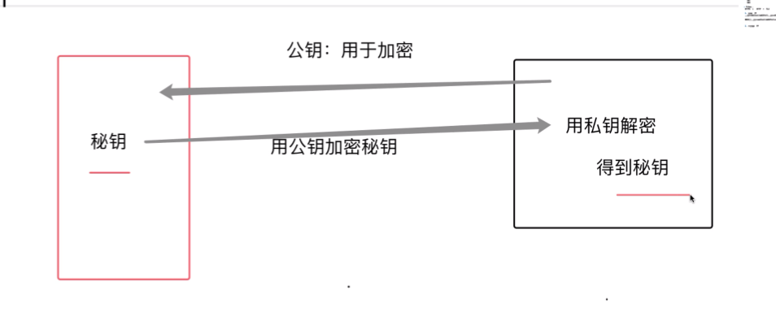

# 超文本传输协议 HTTP/0.9

HTTP协议是基于TCP协议的，要通过TCP建立连接之后才去HTTP传输

1. 客户端发送GET请求，请求一个 xxxx/index.html
2. 服务器接收到请求后，读取对应的html文件，以ASCII的字符流返回给客户端

- 特点：
1. 只有请求行，没有请求头和请求体

2. 没有响应头

3. 传输的内容是以ASCII的字符流

# HTTP /1.0
    相比于0.9 1.0可以支持多种类型文件的传输

    通过引入请求头和响应头来让客户端和服务端更加深入的交流 key-value形式

- 为什么有了请求头和响应头就能支持多种文件的数据传输

请求头: accept:text/html
        accept-encoding:gzip,deflate,br(压缩方式)
        accept-language:zh-CN
响应头: content-type:text/html;charset=utf-8

# HTTP/1.1
页面里面的脚本和资源变多了，加载一份资源可能带来了上百个请求的发送，所以TCP建立连接和断开连接的次数增加了非常多个，性能开销很大，1.1通过持久连接来解决这个问题，但同时也带来了队头阻塞的问题
同时还增加了Host字段，chunk transfer机制等

持久连接，一个TCP连接建立，可以传输多个HTTP请求，减少了大量TCP连接和断开带来的开销

    Connection: keep-alive || close (HTTP1.1默认开启持久连接，close可以关闭)

    浏览器默认支持 6个 TCP持久连接

出现的问题：队头阻塞

1. 管线化：批量发请求（最后放弃了）

- 虚拟机技术的成熟
    请求头：Host字段

- 动态内容
   (http1.0时是静态内容，通过这个响应头表示一个包的大小) content-Length:1024

   Chunk transfer 机制:将数据分割成若干个任意大小的数据块，每个数据块标记好长度，最后发送一个长度为0的数据块来标志发送完毕（这样一来http1.1就可以提供动态内容的支持了

- cookies概念：服务端通过在响应头的设置可以往浏览器的cookies里面存值，前端可以通过代码读取，但是也可以设置其为不可读取

# HTTP/2.0

- 1.1 的问题：带宽用不满
 1. TCP的慢启动：拥塞控制导致一定会慢启动，慢启动导致页面关键资源加载时间推后
 2. 多条TCP连接竞争带宽导致每条TCP连接中能被分配的带宽大大降低（假设带宽是12M/s  六个tcp连接，每个http请求能分配到的约2M/s）
 3. 队头阻塞问题 在一个持久化连接的TCP中，第一个请求的响应没有回来的化，第二个请求就发不出去，这就是队头阻塞，带来了带宽浪费的问题

- 2.0 多路复用

1. 一个域名只使用一个TCP长连接
2. 将每个请求分成一帧一帧的数据进行传输（把每个请求砍碎）并打上编号，同时发送给服务端，并且可以在重要资源请求中编辑为加急，服务端接收到带有各种标号的数据帧后，可以区分哪个数据加急，优先整理和响应该请求的数据帧 （通过引入了二进制分帧层实现多路复用）

# HTTP/HTTPS

- TLS协议

HTTPS = HTTP + TLS

TLS协议里面包含这两种加密方式
1. 对称加密
双方都有相同的秘钥，双方都知道如何加密和解密。

最大的问题：如何让双方都具有相同的密钥，通过网络传输该密钥，一旦被捕获，之后的内容加密也无意义

2. 非对称加密

弥补了对称加密的问题

服务端生成公钥和私钥，将公钥发布出来，客户端接收到公钥后生成一个密钥，再利用公钥加密该密钥传输给服务端，服务端拥堵有的私钥解密得到密钥

# HTTP/3.0

2.0的缺陷：
    1. TCP的队头阻塞（和http的队头阻塞不是一个概念）：当单个数据包丢失时，TCP会暂停后续的包的传输，先重传丢失的包数据
    2. TCP慢启动

- TCP协议僵化：TCP常用于物理层，路由器，交换机，防火墙段都要更新

- QUIC协议：基于UDP实现的
1. 实现了类似于TCP的流量控制和可靠性传输
2. 集成了TLS加密
3. 实现了HTTP2中的多路复用

# XSS攻击
Cross Site Scripting  跨站脚本攻击

黑客往你的页面注入脚本

1. 窃取cokie信息：黑客可以在其他电脑上模拟登入状态
2. 监听用户行为：监听到用户键盘信息，掌握用户信息
3. 伪造登入窗口
4. 在你的页面生成浮窗广告

怎么注入呢？
URL参数注入，输入框注入
1. 存储型攻击：将脚本提交到数据库中 （后端做校验可以解决）
2. 反射型攻击：浏览器给服务端，服务端返回给浏览器
3. 基于DOM的XSS

- 反射性和DOM型通过URL注入脚本
区别是，DOM型服务端返回的代码是正常的

- 储存型：输入用户名时将恶意代码提交到数据库中

- 怎么防范？
校验，过滤，转义，限制
1. 服务端对接收到的脚本进行转码（）
2. 利用好内容安全策略（CSP） 它可以限制一个html里面的第三方js无法被加载
3. HttpOnly   在set-cokie的时候，在末尾加上 HttpOnly ，就算有脚本，也读不到cookie里的值

# CSRF  跨站请求伪造

跨站请求伪造

黑客引诱你打开一个网址，黑客拿到你的登入状态，并通过第三方站点来操作恶意行为

- 预防
1. 利用好Cookie的SameSite属性，第三方站点无法访问cookie，必须是同一个站点

2. 服务端验证请求来源  请求端设置origin或是referer来表明请求来源的地址